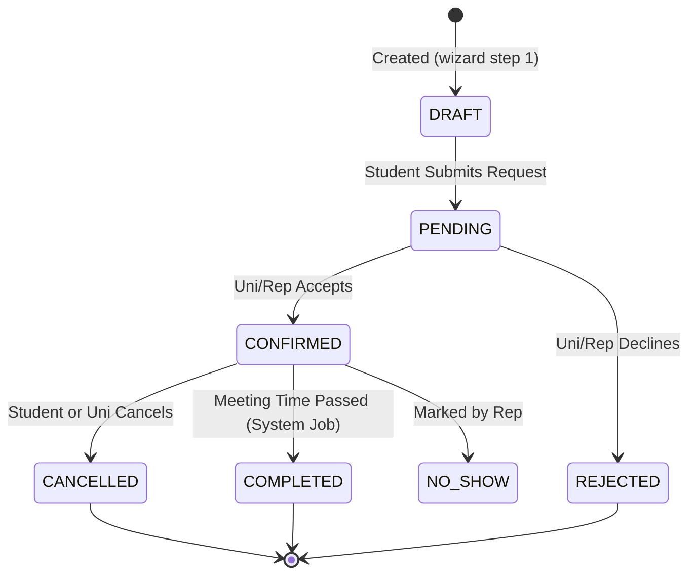

# System Implementation Audit

## 1. Database Schema (PostgreSQL)

The system uses a relational PostgreSQL database managed via Prisma ORM.

### Key Models

#### User & Profiles
- **User**: Core authentication entity.
  - Fields: `id`, `email`, `password` (hashed), `role` (STUDENT, UNIVERSITY, ADMIN, UNIVERSITY_REP), `status`.
  - Relations: `studentProfile`, `universityProfile`.
- **StudentProfile**:
  - Fields: `fullName`, `country`, `currentStatus`, `fieldOfInterest`, `budgetRange`.
- **UniversityProfile**:
  - Fields: `institutionName`, `country`, `website`, `verificationStatus`, `approvalMode`, `isPublic`.
  - Settings: `defaultDuration`, `dailyCapPerRep`, `minLeadTimeHours`.

#### Meeting System
- **Availability**: Time slots defined by Reps.
  - Fields: `dayOfWeek`, `slotStartTime`, `slotEndTime`, `meetingDurationOptions`.
- **MeetingRequest**: Core interaction unit.
  - Fields: `status` (DRAFT, PENDING, CONFIRMED, REJECTED, CANCELLED, COMPLETED, NO_SHOW).
  - Fields: `proposedDatetime`, `durationMinutes`, `meetingLink`, `videoProvider`.
  - Relations: `student`, `university`, `rep`.
- **BookingHold**: Temporary lock for booking flow (concurrency control).

#### Events
- **Event**: University-hosted events.
  - Fields: `title`, `type` (VIRTUAL, PHYSICAL), `dateTime`, `capacity`.
- **EventRegistration**: Student sign-ups for events.

---

## 2. Meeting State Transition Diagram



---

## 3. Role Permission Matrix (RBAC)

| Feature | Student | University Admin | University Rep | Super Admin |
| :--- | :---: | :---: | :---: | :---: |
| **Search Universities** | ✅ | ❌ | ❌ | ✅ |
| **View Profiles** | ✅ | ✅ | ✅ | ✅ |
| **Request Meeting** | ✅ | ❌ | ❌ | ❌ |
| **Manage Availability** | ❌ | ✅ | ✅ | ❌ |
| **Accept/Reject Meeting**| ❌ | ✅ | ✅ | ❌ |
| **Cancel Meeting** | ✅ (Own) | ✅ (Own) | ✅ (Own) | ✅ (All) |
| **Create Events** | ❌ | ✅ | ❌ | ❌ |
| **Register for Events** | ✅ | ❌ | ❌  | ❌ |
| **View Analytics** | ❌ | ✅ | ❌ | ✅ |
| **Manage Reps** | ❌ | ✅ | ❌ | ✅ |

---

## 4. API Endpoints (Server Actions)

Verified Server Actions functioning as API endpoints:

### Auth & User
- `registerStudent(formData)`
- `registerUniversity(formData)`
- `updateUniversitySettings(formData)`

### Meetings
- `getAvailableSlots(universityId, date)`
- `createMeetingRequest(formData)`
- `getUniversityMeetings(status?)`
- `getStudentMeetings()`
- `updateMeetingStatus(meetingId, status, link?)`
- `cancelMeetingByStudent(meetingId, reason)`

### Events
- `getPublicEvents()`
- `getUniversityEvents()`
- `createEvent(formData)`
- `registerForEvent(eventId)`

### Analytics
- `getUniversityMetrics()`
- `getAdminOverview()`

---

## 5. Security Rules & Implementation

### Authentication
- **Framework**: Auth.js (NextAuth v5).
- **Session Strategy**: JWT (Stateless).
- **Middleware**: `middleware.ts` protects `/student`, `/university`, and `/admin` routes.

### Authorization (Row Level Security equivalent)
- **Logic**: Implemented inside Server Actions.
- **Example**:
  ```typescript
  // app/university/settings/actions.ts
  const session = await auth()
  if (session.user.role !== 'UNIVERSITY') throw new Error('Unauthorized')
  // Database Query checks userId matches session
  await prisma.universityProfile.update({ where: { userId: session.user.id } ... })
  ```

---

## 6. Folder Structure

```
app/
├── (auth)/             # Login/Register groups
├── admin/              # Super Admin dashboard
├── api/                # NextAuth route handler
├── events/             # Public event listing
├── student/            # Student portal
│   ├── dashboard/
│   └── meetings/
├── university/         # University portal
│   ├── dashboard/
│   ├── meetings/
│   ├── reps/
│   └── settings/
├── actions.ts          # Shared/Student actions
└── meeting-actions.ts  # Core meeting logic
lib/
├── email.ts            # Nodemailer setup
├── notifications.ts    # Email logic
└── prisma.ts           # DB client
prisma/
├── schema.prisma       # Database definition
└── seed.ts             # Test data script
```

---

## 7. Booking Logic Flow

1.  **Selection**: Student visits `booking/BookingWizard`.
2.  **Date Pick**: Student selects a date.
    - `getAvailableSlots` is called.
    - System checks `Availability` model for Reps active on that `dayOfWeek`.
    - System filters out booked slots from `MeetingRequest`.
3.  **Slot Pick**: Student clicks a time (e.g., "10:00 AM").
4.  **Details**: Student enters "Purpose" and "Questions".
5.  **Submission**:
    - `createMeetingRequest` is called.
    - System finds an available Rep (if not pre-selected).
    - Creates `MeetingRequest` with status `PENDING`.
    - **Notification**: Sends email to Rep ("New Request").
6.  **Confirmation**:
    - Rep views request in `/university/meetings`.
    - Rep clicks "Confirm".
    - `updateMeetingStatus` called.
    - Status -> `CONFIRMED`.
    - **Notification**: Sends email to Student ("Meeting Confirmed").
